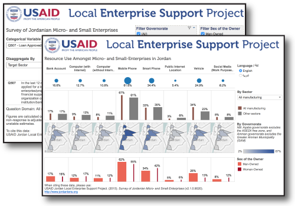

<a href="http://www.jordanlens.org" target="_blank"></a>

# Research & Open Data

A collection of open data and open research by the [USAID Jordan Local Enterprise Support Project](http://www.jordanlens.org).

## Infographics & Posters

* MSE Survey Methodology ![coming soon]
* General Profile ![coming soon]
* Informal Businesses ![coming soon]
* Mains MSE Sectors ![coming soon]
* Gender Dimensions ![coming soon]

## Dashboards

<a href="http://public.tableau.com/profile/usaidlens" target="_blank"></a>

USAID LENS develops dashboards available online on [Tableau Public](http://public.tableau.com/profile/usaidlens). These are meant to be interactive and engaging tools that quick quick access to the results of the survey.

Our infographics:

* [General Survey Results](http://public.tableau.com/profile/usaidlens#!/vizhome/CT_7/Categorical_EN)
* Memberships ![coming soon]
* [Resource Use](http://public.tableau.com/profile/usaidlens#!/vizhome/BETAResourceUse/ResourceUse_EN)
* Financial Performance ![coming soon]
* MSE Sectors ![coming soon]


## Static Reports

### Governorate Reports

```{r, echo=FALSE, message=FALSE}
library(dplyr, warn.conflicts = FALSE)
library(knitr)

md5shield <- function(files, name = "MD5", color = "blue", dir = file.path("~", "Documents", "Work", "research")){
  out <- NULL
  for(file in files){
    md5 <- substr(digest::digest(file = file.path(dir, file)), 1, 10)
    shield <- paste0("https://img.shields.io/badge/", name, "-", md5,"-", color, ".svg")
    out <- c(out, paste0(""))
  }
  out
}

rel_path <- function(area, lang){
  names  <- paste0("Summary Report - ", area, " (", lang, ").pdf")
  file.path("outputs", "reports", "gov_summaries", names)
}

get_info <- function(paths, proj = file.path("~", "Documents", "Work", "research"), 
                     name = "English", color = "blue"){
  # add relative paths
  p <- list(path = paths)
  index <- which(file.exists(file.path(proj, paths)))
  
  # add md5
  p$md5 <- rep("", length(p$path))
  p$md5[index] <- md5shield(p$path[index], name = name, color = color)
  
  # convert to markdown links
  p$pdf <- rep("_coming soon_", length(p$path))
  p$pdf[index] <- paste0("[PDF](", p$path[index],") ")
  
  p
}


gov <- data.frame(Governorate = c("Amman", "Aqaba", "Irbid", "Karak", "Tafilah", "Zarqa")) %>%
  mutate(English = get_info(rel_path(Governorate, lang = "English"))[["pdf"]],
         Arabic = get_info(rel_path(Governorate, lang = "Arabic"))[["pdf"]],
         `Version (MD5 checksums)` = paste(get_info(rel_path(Governorate, lang = "English"))[["md5"]],
            get_info(rel_path(Governorate, lang = "Arabic"), name = "Arabic", color = "red")[["md5"]]))

kable(gov, format = "html")
```

<i>NB: As USAID LENS aims to serve lesser-advantaged communitities in Jordan, "Amman" governorate excludes the Greater Amman Municipality (GAM) in the MSE survey, and "Aqaba" governorate excludes the ASEZA free-zone.</i>

### Issue-Snapshots

* Gender Dimensions of Micro- and Small-Enterprises in Jordan. [coming soon]
* Main Sub-Sectors of Jordanian Micro- and Small-Enterprises. [coming soon]

# Open Data

USAID LENS believes in open and access to its MSE research. As the mainstay of its technical research, the 2014-15 survey of micro- and small-enterprises (MSE survey) falls at the heart of this initiative.

## MSE Survey


### Open-Data Repositories

Additionally to being able to download the data via github, the MSE Survey will be made available on [figshare open data repository](https://figshare.com/) for greater dissemination among the scientific community. 

### Citing the MSE Survey 

To cite the MSE Survey in publications use:

> USAID Jordan Local Enterprise Support Project (2015). "Survey of Jordanian Micro- and Small-Enterprises."
  version 2.2.0. <http://www.jordanlens.org>


[coming soon]: data:image/gif;base64,R0lGODlhPwAKALMAABsUZP///3ZyovDv9YWCrDkzecLA1tHQ4FhTjaShweHg6mdimElDg5WRtyokbrOxyyH5BAAAAAAALAAAAAA/AAoAAATgEMhJq7046827/1hxBAMBJEFgFAASLMBCkkBgMkHjPKQwEakGgDE6MCSoQEJiG+YmCsMClRgIFgdFLHAAjGSmFEMQ2CkQAsTEJhgAogKD+6EQCBSPWmBclrgcEgUBPgCCCEA2KUA+KVYBNT4OLBIGOQ4uLIaDEmR6jhOYa4SGDQOVcg2bgwMpNTCpkwAEAwehmoSdq61QBwsEB1VXWQAPtQEIB5UEDoM4jwYKvntIh49RC9AnVm0JzALOFCIkQkkrNQYTlePTQAAOlQoBk0km4gfzKUupR+0g/v8AAwoEEQEAOw==
