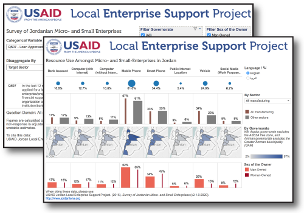

# Research at USAID LENS

A collection of open data and open research by the [USAID Jordan Local Enterprise Support Project](http://www.jordanlens.org).

## Infographics & Posters

* MSE Survey Methodology ![coming soon]
* General Profile ![coming soon]
* Informal Businesses ![coming soon]
* Mains MSE Sectors ![coming soon]
* Gender Dimensions ![coming soon]

## Dashboards

USAID LENS develops dashboards available online on [Tableau Public](http://public.tableau.com/profile/usaidlens). These are meant to be interactive and engaging tools that quick quick access to the results of the survey.

Our infographics:

* [General Survey Results](http://public.tableau.com/profile/usaidlens#!/vizhome/CT_7/Categorical_EN)
* Memberships ![coming soon]
* [Resource Use](http://public.tableau.com/profile/usaidlens#!/vizhome/BETAResourceUse/ResourceUse_EN)
* Financial Performance ![coming soon]
* MSE Sectors ![coming soon]

## Static Reports

### Governorate Reports

| Governorate  | English | Arabic | Version History |
|--------------|---------|--------|-----------------|
| Amman[^amm]  |  [PDF](outputs/reports/gov_summaries/Summary Report - Amman (English).pdf) | _coming soon_ |   |
| Aqaba[^aqb]  | [PDF](outputs/reports/gov_summaries/Summary Report - Aqaba (English).pdf) | [PDF](outputs/reports/gov_summaries/Summary Report - Aqaba (Arabic).pdf) |   |
| Irbid        | [PDF](outputs/reports/gov_summaries/Summary Report - Irbid (English).pdf) | _coming soon_ |    |
| Karak        | [PDF](outputs/reports/gov_summaries/Summary Report - Karak (English).pdf) | [PDF](outputs/reports/gov_summaries/Summary Report - Karak (Arabic).pdf) |   |
| Tafilah      | [PDF](outputs/reports/gov_summaries/Summary Report - Tafilah (English).pdf) | [PDF](outputs/reports/gov_summaries/Summary Report - Tafilah (Arabic).pdf) |   |
| Zarqa        | [PDF](outputs/reports/gov_summaries/Summary Report - Zarqa (English).pdf) | _coming soon_ |   |

[^amm]: As USAID LENS aims to serve lesser-advantaged communitities in Jordan, "Amman" governorate excludes the Greater Amman Municipality (GAM) for the purposes of the MSE survey.

[^aqb]: "Aqaba" governorate excludes the ASEZA free-zone.

### Issue-Snapshots

* Gender Dimensions of Micro- and Small-Enterprises in Jordan. [coming soon]
* Main Sub-Sectors of Jordanian Micro- and Small-Enterprises. [coming soon]

# Open Data

USAID LENS believes in open and access to its MSE research. As the mainstay of its technical research, the 2014-15 survey of micro- and small-enterprises (MSE survey) falls at the heart of this initiative.

## MSE Survey

### Other Open-Data Repositories

Additionally to being able to download the data via github, the MSE Survey will be made available on [figshare open data repository](https://figshare.com/) for greater dissemination among the scientific community. 

### Citing the MSE Survey 

To cite the MSE Survey in publications use:

> USAID Jordan Local Enterprise Support Project (2015). "Survey of Jordanian Micro- and Small-Enterprises."
  version 2.2.0. <http://www.jordanlens.org>

[coming soon]: data:image/gif;base64,R0lGODlhPwAKALMAABsUZP///3ZyovDv9YWCrDkzecLA1tHQ4FhTjaShweHg6mdimElDg5WRtyokbrOxyyH5BAAAAAAALAAAAAA/AAoAAATgEMhJq7046827/1hxBAMBJEFgFAASLMBCkkBgMkHjPKQwEakGgDE6MCSoQEJiG+YmCsMClRgIFgdFLHAAjGSmFEMQ2CkQAsTEJhgAogKD+6EQCBSPWmBclrgcEgUBPgCCCEA2KUA+KVYBNT4OLBIGOQ4uLIaDEmR6jhOYa4SGDQOVcg2bgwMpNTCpkwAEAwehmoSdq61QBwsEB1VXWQAPtQEIB5UEDoM4jwYKvntIh49RC9AnVm0JzALOFCIkQkkrNQYTlePTQAAOlQoBk0km4gfzKUupR+0g/v8AAwoEEQEAOw==