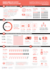
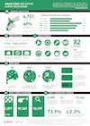
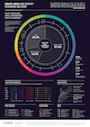
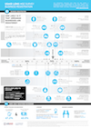
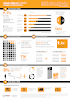
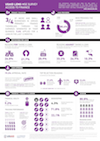

-   [Survey of Micro- and Small-Enterprises (MSEs) in Jordan](#survey-of-micro--and-small-enterprises-mses-in-jordan)
    -   [Infographics](#infographics)
    -   [Dashboards](#dashboards)
    -   [Static Reports](#static-reports)
    -   [Raw Data](#raw-data)
-   [Citing the MSE Survey](#citing-the-mse-survey)

Survey of Micro- and Small-Enterprises (MSEs) in Jordan
=======================================================

Although Jordan’s economy is dominated by micro and small enterprises (MSEs), relatively little is known about them. To overcome this informational gap, USAID LENS conducted a survey of MSEs in 2014-2015 to better understand Jordanian enterprises and to assess the major barriers and opportunities for growth. The study covers general demographics, workforce trends, firm performance, access to finance, processes and networks, and the impact of the Syrian refugee crisis.

The survey consists of 86 questions in a double sampling design with stratification. The data gathers representative information for all MSEs operating in the governorates of Amman (excluding the Greater Amman Municipality), Zarqa, Irbid, Karak, Tafilah, and Aqaba (excluding the ASEZA free zone). Although the study is not intended to be national in scope, the target population of the six areas collectively capture 60% of the kingdom’s population.

As a complex survey, the research design was undertaken using probability sampling in two phases. In the first phase, 977 geographic clusters were randomly selected from districts in each area. From these clusters, 97,347 households were contacted through door-to-door interviews, of which 10,197 reported owning a business. A sub-sample of 6,385 MSEs was then drawn, stratified by sector governorate. 4,721 of these MSEs were then successfully surveyed. The results can reliably be generalized to all MSEs within this geographic boundary.

Infographics
------------

The USAID LENS infographics provide a visual take on a number of findings from the MSE survey.

| Title                 | Description                                                                                    | Preview                                        | Link                                                                                                                                                                                                                                                                                                                           |
|:----------------------|:-----------------------------------------------------------------------------------------------|:-----------------------------------------------|:-------------------------------------------------------------------------------------------------------------------------------------------------------------------------------------------------------------------------------------------------------------------------------------------------------------------------------|
| General Profile       | General sketch of the typical MSE owner in Jordan.                                             |        | English: [PDF](outputs/infographics/MSE_Infographics_General_Profile_EN.pdf), [PNG](outputs/infographics/MSE_Infographics_General_Profile_EN.png)  Arabic: [PDF](outputs/infographics/MSE_Infographics_General_Profile_AR.pdf), [PNG](outputs/infographics/MSE_Infographics_General_Profile_AR.png)                         |
| Survey Mechanism      | A visual explanation of the sampling design and general research methodology.                  |       | English: [PDF](outputs/infographics/MSE_Infographics_Survey_Mechanism_EN.pdf), [PNG](outputs/infographics/MSE_Infographics_Survey_Mechanism_EN.png)  Arabic: [PDF](outputs/infographics/MSE_Infographics_Survey_Mechanism_AR.pdf), [PNG](outputs/infographics/MSE_Infographics_Survey_Mechanism_AR.png)                     |
| Economic Sectors      | A high-level overview of the major industrial sectors in which MSEs operate.                   |       | English: [PDF](outputs/infographics/MSE_Infographics_Economic_Sectors_EN.pdf), [PNG](outputs/infographics/MSE_Infographics_Economic_Sectors_EN.png)  Arabic: [PDF](outputs/infographics/MSE_Infographics_Economic_Sectors_AR.pdf), [PNG](outputs/infographics/MSE_Infographics_Economic_Sectors_AR.png)                     |
| Business Registration | A visual detailing the likelihood of being registered with the Ministry of Industry and Trade. |  | English: [PDF](outputs/infographics/MSE_Infographics_Business_Registration_EN.pdf), [PNG](outputs/infographics/MSE_Infographics_Business_Registration_EN.png)  Arabic: [PDF](outputs/infographics/MSE_Infographics_Business_Registration_AR.pdf), [PNG](outputs/infographics/MSE_Infographics_Business_Registration_AR.png) |
| Gender Differences    | Major differences between man-owned and woman-owned businesses in Jordan.                      |     | English: [PDF](outputs/infographics/MSE_Infographics_Gender_Differences_EN.pdf), [PNG](outputs/infographics/MSE_Infographics_Gender_Differences_EN.png)  Arabic: [PDF](outputs/infographics/MSE_Infographics_Gender_Differences_AR.pdf), [PNG](outputs/infographics/MSE_Infographics_Gender_Differences_AR.png)             |
| Access To Finance     | The major trends affecting MSE financing in Jordan.                                            |      | English: [PDF](outputs/infographics/MSE_Infographics_Access_To_Finance_EN.pdf), [PNG](outputs/infographics/MSE_Infographics_Access_To_Finance_EN.png)  Arabic: [PDF](outputs/infographics/MSE_Infographics_Access_To_Finance_AR.pdf), [PNG](outputs/infographics/MSE_Infographics_Access_To_Finance_AR.png)                 |

Dashboards
----------

USAID LENS develops dashboards available online on <a href="http://public.tableau.com/profile/usaidlens" target="_blank">Tableau Public</a>. These are interactive and engaging tools that provide quick access to the results of the survey.

Our infographics:

-   <a href="http://public.tableau.com/profile/usaidlens#!/vizhome/CT_7/Categorical_EN" target="_blank">General Survey Results</a>

-   <a href="http://public.tableau.com/profile/usaidlens#!/vizhome/ResourceUse/Memberships_EN" target="_blank">Memberships</a>

-   <a href="http://public.tableau.com/profile/usaidlens#!/vizhome/BETAResourceUse/ResourceUse_EN" target="_blank">Resource Use</a>

-   Financial Performance \[coming soon\]

-   MSE Sectors \[coming soon\]

Static Reports
--------------

### Governorate Reports

The governorate reports provide a high level overview of the MSE survey findings at the level of the governorate.

| Governorate | English                                                                          | Arabic                                                                          | Version (MD5 checksums)                                                                                                                       |
|:------------|:---------------------------------------------------------------------------------|:--------------------------------------------------------------------------------|:----------------------------------------------------------------------------------------------------------------------------------------------|
| Amman       | [PDF](outputs/reports/gov_summaries/Summary_Report_Amman_(English)_PUBLIC.pdf)   | [PDF](outputs/reports/gov_summaries/Summary_Report_Amman_(Arabic)_PUBLIC.pdf)   |   |
| Aqaba       | [PDF](outputs/reports/gov_summaries/Summary_Report_Aqaba_(English)_PUBLIC.pdf)   | [PDF](outputs/reports/gov_summaries/Summary_Report_Aqaba_(Arabic)_PUBLIC.pdf)   |   |
| Irbid       | [PDF](outputs/reports/gov_summaries/Summary_Report_Irbid_(English)_PUBLIC.pdf)   | [PDF](outputs/reports/gov_summaries/Summary_Report_Irbid_(Arabic)_PUBLIC.pdf)   |   |
| Karak       | [PDF](outputs/reports/gov_summaries/Summary_Report_Karak_(English)_PUBLIC.pdf)   | [PDF](outputs/reports/gov_summaries/Summary_Report_Karak_(Arabic)_PUBLIC.pdf)   |   |
| Tafilah     | [PDF](outputs/reports/gov_summaries/Summary_Report_Tafilah_(English)_PUBLIC.pdf) | [PDF](outputs/reports/gov_summaries/Summary_Report_Tafilah_(Arabic)_PUBLIC.pdf) |   |
| Zarqa       | [PDF](outputs/reports/gov_summaries/Summary_Report_Zarqa_(English)_PUBLIC.pdf)   | [PDF](outputs/reports/gov_summaries/Summary_Report_Zarqa_(Arabic)_PUBLIC.pdf)   |   |

<i>NB: As USAID LENS aims to serve lesser-advantaged communitities in Jordan, "Amman" governorate excludes the Greater Amman Municipality (GAM) in the MSE survey, and "Aqaba" governorate excludes the ASEZA free-zone.</i>

### Issue-Snapshots

-   Gender Dimensions of Micro- and Small-Enterprises in Jordan. \[coming soon\]
-   Main Sub-Sectors of Jordanian Micro- and Small-Enterprises. \[coming soon\]

Raw Data
--------

 

As the mainstay of its technical research, the 2014-15 survey of micro- and small-enterprises (MSE survey) is a valuable resource not only for USAID but also for government, other aid donors, and business service providers. A public release of the micro-data is made available by USAID LENS under the a <a href="http://opendatacommons.org/licenses/by/1.0/" target="_blank">Open Data Commons Attribution License v1.0</a>. The Excel data can be downloaded in [English](data/MSE_SURVEY_PUBLIC/2015/MSE_SURVEY_PUBLIC_EN.xlsx) or [Arabic](data/MSE_SURVEY_PUBLIC/2015/MSE_SURVEY_PUBLIC_AR.xlsx), and is additionally provided <a href="https://github.com/jordanlens/research/tree/master/data/MSE_SURVEY_PUBLIC/2015" target="_blank">in the data repository</a> under a number of alternate formats such as csv, ARFF, text, SPSS (sav), and STATA (dta).

USAID LENS plans to make the MSE survey data compliant with <a href="http://5stardata.info/en/" target="_blank">5-star level of open-data</a> standard. USAID LENS plans to obtain <a href="https://certificates.theodi.org/en/" target="_blank">open data certification</a> from the Open Data Institute to further reinforce its committment to transparent research.

#### Data Anonymization

The public release of the MSE survey data has been trimmed down in order to protect the confidentiality of responses of interviewees.

Ensuring confidentiality of survey participants is an important part of the research process and central to the <a href="https://en.wikipedia.org/wiki/Common_Rule" target="_blank">Common Rule</a>. Fortunately, diclosure risk for most survey data is inherently low due to the fact that re-identification requires "respondent knowledge"-- that is, knowledge of whether a given individual participated in the study. Most questions asked in the MSE survey are fairly benign. Nonetheless, USAID LENS has put the MSE survey data through *statistical disclosure control* (SDC) prior to public release. As a result of this risk analysis, a number of variables have been removed, collapsed, and recoded. The process balances the competing objectives of ensuring confidentiality whilst maximing utility for end users.

Supporting documentation on the public release will be provided in May 2016. This will include information on survey weights as well as information on the statistical disclosure procedures performed on the public data. In the interim, please contact [our project staff](mailto:rphellwig@jordanlens.org) with questions.

#### Open-Data Repositories

Additionally to Github, the MSE Survey data and outputs will be made available on <a href="https://figshare.com/" target="_blank">figshare</a>, <a href="http://datadryad.org/" target="_blank">dryad</a>, the <a href="https://www.usaid.gov/data/" target="_blank">Development Data Library</a>, and the <a href="https://usaidjordankmportal.com/resources/survey-of-micro-and-small-enterprises-mses-in-jordan" target="_blank">USAID Jordan Knowledge Management Portal</a> for greater dissemination among the donor and scientific community.

Citing the MSE Survey
=====================

To cite the MSE Survey in publications, please use:

> USAID Jordan Local Enterprise Support Project (2015). "Survey of Jordanian Micro- and Small-Enterprises." version 2.3.1. <http://www.jordanlens.org>

For previous versions of MSE survey data and output, please consult the <a href="https://github.com/jordanlens/research/commits/master" target="_blank">version control history</a>.
